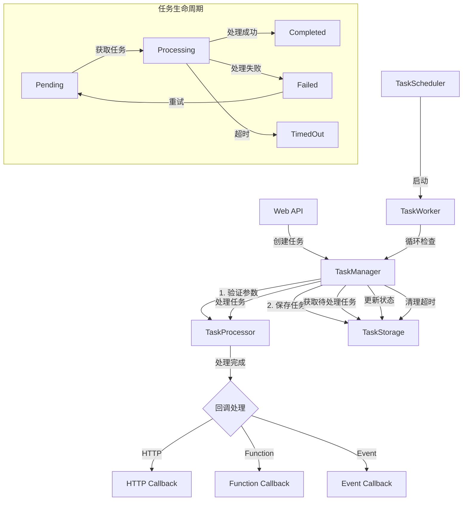
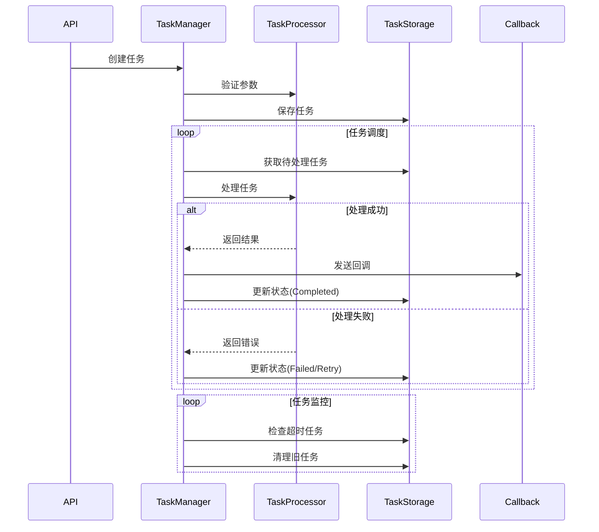

```mermaid
graph TD
    A[Web API] -->|创建任务| B[TaskManager]
    B -->|1. 验证参数| C[TaskProcessor]
    B -->|2. 保存任务| D[TaskStorage]
    
    E[TaskScheduler] -->|启动| F[TaskWorker]
    F -->|循环检查| B
    
    B -->|获取待处理任务| D
    B -->|处理任务| C
    
    C -->|处理完成| G{回调处理}
    G -->|HTTP| H[HTTP Callback]
    G -->|Function| I[Function Callback]
    G -->|Event| J[Event Callback]
    
    B -->|更新状态| D
    B -->|清理超时| D
    
    subgraph 任务生命周期
        K[Pending]-->|获取任务|L[Processing]
        L -->|处理成功| M[Completed]
        L -->|处理失败| N[Failed]
        L -->|超时| O[TimedOut]
        N -->|重试| K
    end
```

```mermaid
sequenceDiagram
    participant API
    participant TaskManager
    participant TaskProcessor
    participant TaskStorage
    participant Callback

    API->>TaskManager: 创建任务
    TaskManager->>TaskProcessor: 验证参数
    TaskManager->>TaskStorage: 保存任务
    
    loop 任务调度
        TaskManager->>TaskStorage: 获取待处理任务
        TaskManager->>TaskProcessor: 处理任务
        alt 处理成功
            TaskProcessor-->>TaskManager: 返回结果
            TaskManager->>Callback: 发送回调
            TaskManager->>TaskStorage: 更新状态(Completed)
        else 处理失败
            TaskProcessor-->>TaskManager: 返回错误
            TaskManager->>TaskStorage: 更新状态(Failed/Retry)
        end
    end

    loop 任务监控
        TaskManager->>TaskStorage: 检查超时任务
        TaskManager->>TaskStorage: 清理旧任务
    end
```